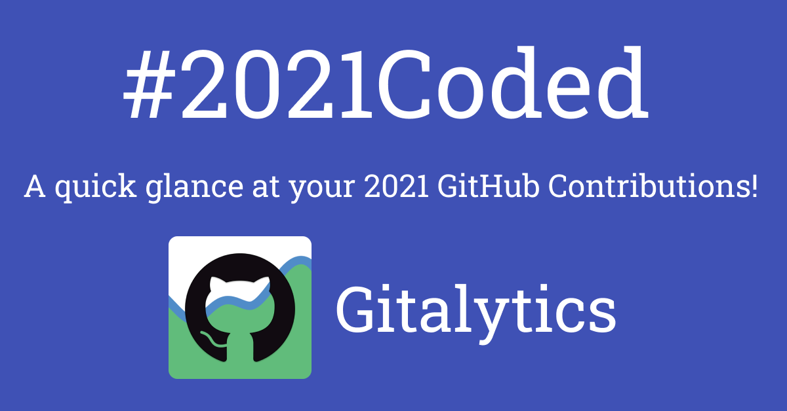

# Gitalytics <!-- omit in toc -->

> A simple overview of your github activities <https://gitalytics.netlify.app>

<p align="center">

</p>

---

## Table of Contents <!-- omit in toc -->

- [About](#about)
  - [What is this?](#what-is-this)
  - [How I built it](#how-i-built-it)
  - [How does it look?](#how-does-it-look)
  - [What does it show?](#what-does-it-show)
  - [Export](#export)
- [Development](#development)
  - [Environment Variables](#environment-variables)
  - [Local Setup](#local-setup)
    - [Running the projects](#running-the-projects)
    - [GraphQL](#graphql)
- [Instructions to Deploy](#instructions-to-deploy)
  - [Important Notes on Deployment](#important-notes-on-deployment)
- [Contributors ✨](#contributors-)

## About

### What is this?

I built an app called Gitalytics, which will show summarized GitHub Activities.

I got inspired from Spotify Year in Review feature and thought that developers should also see their GitHub Year in Review, a.k.a [#2020Coded](https://twitter.com/search?q=%232020Coded&src=typed_query).

### How I built it

I have created an NX workspace using angular-nest preset. For more on code visit my article on dev.to: [Basic Structure Done with Nx and Deployed on DigitalOcean App Platform](https://dev.to/shhdharmen/gitalytics-basic-structure-done-with-nx-and-deployed-on-digitalocean-app-platform-5a6p)

### How does it look?

#2020Coded Page (Light theme):


#2020Coded Page (Dark theme):


### What does it show?

As of now, Gitalytics can get and show following details of 2020 fetched from GitHub:

1. Repositories
2. Star count (from 1st 100 [CreatedRepositoryContribution](https://docs.github.com/en/free-pro-team@latest/graphql/reference/objects#createdrepositorycontribution))
3. Fork count (from 1st 100 [CreatedRepositoryContribution](https://docs.github.com/en/free-pro-team@latest/graphql/reference/objects#createdrepositorycontribution))
4. Commits
5. Issues
6. Closed Issues (from 1st 100 [CreatedIssueContribution](https://docs.github.com/en/free-pro-team@latest/graphql/reference/objects#createdissuecontribution))
7. Pull Requests
8. Merged Pull Requests (from 1st 100 [CreatedPullRequestContribution](https://docs.github.com/en/free-pro-team@latest/graphql/reference/objects#createdpullrequestcontribution))
9. Closed Pull Requests (from 1st 100 [CreatedPullRequestContribution](https://docs.github.com/en/free-pro-team@latest/graphql/reference/objects#createdpullrequestcontribution))
10. Pull Request Reviews
11. Comments and Reactions on Pull Request Reviews (from 1st 100 [CreatedPullRequestReviewContribution](https://docs.github.com/en/free-pro-team@latest/graphql/reference/objects#createdpullrequestreviewcontribution))

### Export

You can export each data as PNG. And you can also share stats on twitter. I will look like below:


---

## Development

### Environment Variables

A sample is provided a `.env.sample` file.

| Variable          | Description                                  | Dev Value                        | Prod Value                       | Needed for           |
| ----------------- | -------------------------------------------- | -------------------------------- | -------------------------------- | -------------------- |
| `PAT`             | GitHub Person Access Token                   | `TOKEN`                          | `TOKEN`                          | Backend              |
| `API_URL`         | GitHub GraphQL API Endpoint                  | `https://api.github.com/graphql` | `https://api.github.com/graphql` | Backend              |
| `PORT`            | Where you want to run your nestjs app        | `3000`                           | `8080`                           | Backend              |
| `WHITELIST_URL`   | Comma separated URLs to allow access to APIs | `http://localhost:4200`          | `FRONT_END_APP_URL`              | Backend              |
| `NODE_ENV`        | Environment where app is running             | `development`                    | `production`                     | Backend and Frontend |
| `BACKEND_API_URL` | URL where api is running                     | `/api`                           | `BACK_END_APP_URL`               | Frontend             |

You can create an app and get keys for twitter bot from: <https://apps.twitter.com/>.

### Local Setup

```bash
git clone https://github.com/shhdharmen/gitalytics
cd gitalytics
npm i
```

After that, copy content from `.env.sample` and create `.env` with values.

#### Running the projects

**Client (Frontend)**:

```bash
npm run config
nx serve api
```

**API (Backend)**:

```bash
nx serve client
```

#### GraphQL

All the GraphQL related stuff is maintained at: `apps/client/src/.graphql`. You can generate related angular service and typescript file using below command, thanks to [GraphQL Code Generator](https://graphql-code-generator.com/):

```bash
npm run generate-codegen
```

## Instructions to Deploy

### Important Notes on Deployment

- Make sure you have all your environment variables in place
- You will need to add frontend app urls separated by comma to `WHITELIST_URL` in environment variables
- You will need to add backend api url in `BACKEND_API_URL` in environment variables

---

## Contributors ✨

Thanks goes to these wonderful people ([emoji key](https://allcontributors.org/docs/en/emoji-key)):

<!-- ALL-CONTRIBUTORS-LIST:START - Do not remove or modify this section -->
<!-- prettier-ignore-start -->
<!-- markdownlint-disable -->
<table>
  <tr>
    <td align="center"><a href="https://github.com/shhdharmen"><br /><sub><b>Dharmen Shah</b></sub></a><br /><a href="#blog-shhdharmen" title="Blogposts">📝</a> <a href="https://github.com/shhdharmen/gitalytics/commits?author=shhdharmen" title="Code">💻</a> <a href="#content-shhdharmen" title="Content">🖋</a> <a href="#design-shhdharmen" title="Design">🎨</a> <a href="https://github.com/shhdharmen/gitalytics/commits?author=shhdharmen" title="Documentation">📖</a> <a href="#ideas-shhdharmen" title="Ideas, Planning, & Feedback">🤔</a> <a href="#infra-shhdharmen" title="Infrastructure (Hosting, Build-Tools, etc)">🚇</a> <a href="#maintenance-shhdharmen" title="Maintenance">🚧</a> <a href="#projectManagement-shhdharmen" title="Project Management">📆</a> <a href="#research-shhdharmen" title="Research">🔬</a></td>
  </tr>
</table>

<!-- markdownlint-restore -->
<!-- prettier-ignore-end -->

<!-- ALL-CONTRIBUTORS-LIST:END -->

This project follows the [all-contributors](https://github.com/all-contributors/all-contributors) specification. Contributions of any kind welcome!
